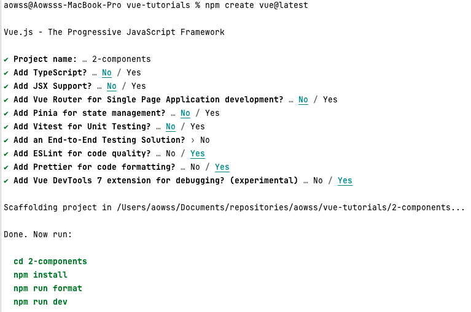

<!-- TOC -->
* [Vue.js 3 Fundamentals with the Composition API](#vuejs-3-fundamentals-with-the-composition-api)
    * [Setup](#setup)
    * [Build and Run](#build-and-run)
        * [Install Dependencies](#install-dependencies)
        * [Compile and Hot-Reload for Development](#compile-and-hot-reload-for-development)
        * [Compile and Minify for Production](#compile-and-minify-for-production)
<!-- TOC -->

# Vue.js 3 Fundamentals with the Composition API

See [Vue Component Fundamentals with the Composition API](https://vueschool.io/courses/vue-component-fundamentals-with-the-composition-api)

## Setup

We use the [`create-vue` package](https://github.com/vuejs/create-vue) to scaffold the project as described in [Vue's tooling documentation page](https://vuejs.org/guide/scaling-up/tooling.html#vite).

This will use [Vite](https://vitejs.dev/) as the build tool and development environment.



This will generate the following structure:

```
2-components
├── README.md
├── index.html
├── jsconfig.json
├── package.json
├── public
│   └── favicon.ico
├── src
│   ├── App.vue
│   ├── assets
│   │   ├── base.css
│   │   ├── logo.svg
│   │   └── main.css
│   ├── components
│   │   ├── HelloWorld.vue
│   │   ├── TheWelcome.vue
│   │   ├── WelcomeItem.vue
│   │   └── icons
│   │       ├── IconCommunity.vue
│   │       ├── IconDocumentation.vue
│   │       ├── IconEcosystem.vue
│   │       ├── IconSupport.vue
│   │       └── IconTooling.vue
│   └── main.js
└── vite.config.js
```

We can then delete everything under the `src` folder, except `App.vue` and `main.js`.  
We should end up with the following structure:

```
2-components
├── README.md
├── index.html
├── jsconfig.json
├── package.json
├── public
│   └── favicon.ico
├── src
│   ├── App.vue
│   └── main.js
└── vite.config.js
```

We can then delete the content of `App.vue` and only keep the structure:

```vue
<script setup>
</script>

<template>
</template>
```

## Build and Run

### Install Dependencies

```sh
npm install
```

### Compile and Hot-Reload for Development

```sh
npm run dev
```

### Compile and Minify for Production

```sh
npm run build
```
